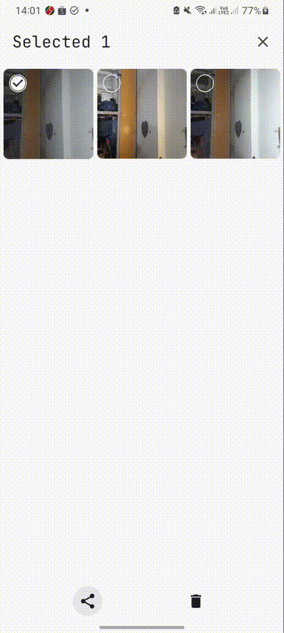

# My Camera

## Description

My Camera is an Android application that allows users to take pictures, view a list of captured
images, and edit them with various features.

## Features

### 1. Take a Picture

- **Camera Flash Option**: Toggle the camera flash on or off.
- **Network Enable/Disable**: Control the network access for the camera functionality.
- **Change Camera Zoom Ratio**: Adjust the zoom level of the camera.
- **Switch Between Front and Back Camera**: Easily switch the camera view.
- **Capture Photo**: Take pictures effortlessly.

### 2. Show List of Pictures

- **Multiple Selection**: Select multiple images from the gallery.
- **Delete Selected Images**: Remove unwanted images from the list.
- **Share Selected Images**: Share images via various platforms.
- **Zoom In/Out**: View images in detail with zoom functionality.

### 3. Edit Pictures

- **Crop Image**: Easily crop images to your desired dimensions.
- **Rotate Image**: Rotate images to adjust orientation.
- **Flip Image**: Flip images horizontally or vertically.
- **Adjustments**: Fine-tune images with adjustments for:
    - Brightness
    - Shadowing
    - Sharpness
    - Saturation
    - Contrast
    - Temperature
- **Save Changes**: Save edited images as new files or replace the originals.

## Tech Stack

- **Programming Language**: Kotlin
- **UI Framework**: Jetpack Compose
- **Image Cropping Library
  **: [Android Image Cropper](https://github.com/CanHub/Android-Image-Cropper)

## Screenshots and Videos

**Video Demos**: [Demo](https://youtu.be/qIouprJ-VqU)

**Shorts**:

  
  
  

  
  
  
  

  
  
  
  
  

